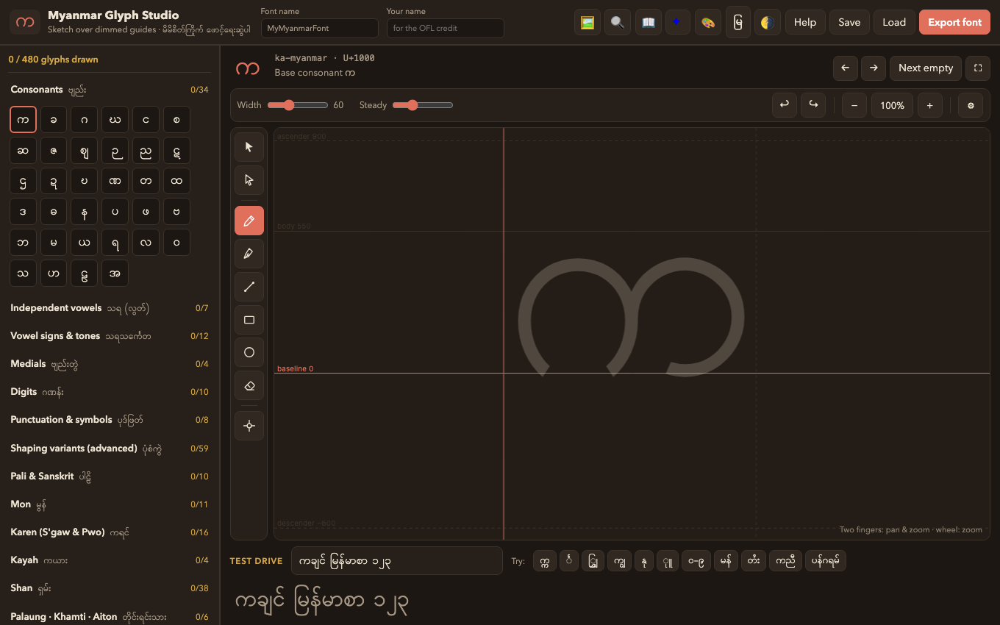
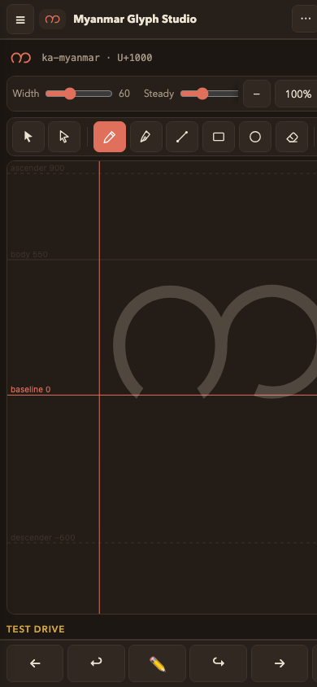

# မြန်မာဖောင့် ရေးဆွဲကိရိယာ (Myanmar Glyph Studio)

**ကိုယ်ပိုင်မြန်မာဖောင့်ကို ဘရောက်ဇာထဲမှာ စာလုံးတစ်လုံးချင်း ရေးဆွဲပြီး —
တကယ် install လုပ်သုံးလို့ရတဲ့ Unicode ဖောင့်အစစ်အဖြစ် တည်ဆောက်နိုင်ပါတယ်။**

**✏️ ချက်ချင်းစမ်းကြည့်ပါ (ဘာမှ install မလိုပါ) —**
<https://thiha-lynn.github.io/myanmar-glyph-studio/>

**🖼 ဖောင့်ပြခန်း —**
<https://thiha-lynn.github.io/myanmar-glyph-studio/gallery.html>

*(English README → [README.md](README.md))*

  
  

## ဘယ်လိုအလုပ်လုပ်သလဲ

၁. **ရေးဆွဲပါ** — မှိန်ပြထားတဲ့ လမ်းညွှန်စာလုံး (က ခ ဂ …) ပေါ်မှာ
ကိုယ့်လက်ရေးပုံစံအတိုင်း အုပ်ရေးဆွဲပါ။ ဖုန်း၊ တက်ဘလက် (Apple Pencil
ဖိအားနဲ့ မျဉ်းအထူပြောင်းနိုင်)၊ ကွန်ပျူတာ — အားလုံးမှာ အလုပ်လုပ်ပါတယ်။
က္က လို ထပ်စာလုံးတွေအတွက် အောက်ကစာလုံးလေးကိုပဲ ရေးဆွဲရပြီး၊
သရသင်္ကေတတွေကို အစက်ဝိုင်း ◌ ဘေးမှာ ရေးဆွဲရပါတယ်။

စုတ်တံအပြင် ဒီဇိုင်နာသုံးကိရိယာတွေလည်း ပါပါတယ် — Bézier ပင်
(အမှတ်နှိပ်၊ ဆွဲ၍ကွေး)၊ ရွေးချယ်၍ ရွှေ့/ချဲ့/လှည့်ခြင်း၊ အမှတ်ပြင်
node editor၊ အက္ခရာချင်း ကူးထည့်ခြင်း (Copy → Paste)၊
တစ်ပိုင်းဖျက်နိုင်တဲ့ ခဲဖျက်၊ ကွက်ချိတ် (snap) စတာတွေပါ။

၂. **စမ်းသပ်ပါ** — Test drive အကွက်မှာ ရေးထားတဲ့စာလုံးတွေနဲ့
စာကြောင်းအစစ်ကို ချက်ချင်းမြင်ရပြီး၊ **Export font** နှိပ်တာနဲ့
စမ်းသုံးလို့ရတဲ့ draft TTF ဖိုင် ရပါတယ်။

၃. **တည်ဆောက်ပါ** — **Save** နဲ့ project ဖိုင်ကို သိမ်းပြီး
`pipeline/build.sh` ကို run ရင် — ထပ်စာလုံး (က္က)၊ ကင်းစီး (င်္)၊
ရရစ် (ြ)၊ သရသင်္ကေတနေရာချထားမှု အပြည့်အစုံပါတဲ့ ဖောင့်အစစ်
ထွက်လာပါတယ်။

**မြန်မာစာလုံးပုံစံ ~၁၅၀ ကျော်သာ ရေးဆွဲရပါတယ်** — ကျန်တဲ့
OpenType shaping စည်းမျဉ်းတွေ (blwf, rphf, pres, blws, mark/mkmk)
ကို toolchain က အလိုအလျောက် ထုတ်ပေးပါတယ်။ ဖောင့်ပညာရှင်
မဟုတ်လည်း ရပါတယ်။

မြန်မာ Unicode block အပြည့်အပြင် Extended-A/B ပါ ပါဝင်လို့ —
ဗမာစာသာမက **မွန်၊ ရှမ်း၊ စကောကရင်၊ ပိုးကရင်၊ ကယား၊ ပအိုဝ်း၊
ပလောင်၊ ခန္တီးရှမ်း** ဘာသာစကားတွေအတွက်ပါ ဖောင့်ပြုလုပ်နိုင်ပါတယ်။

## ပါဝင်ကူညီရန်

**စာလုံးတစ်လုံး ရေးဆွဲပေးတာတောင် တကယ့် contribution ဖြစ်ပါတယ်။**

- စရန်လွယ်တဲ့ အလုပ်လေးခု — [ဖိတ်ခေါ်ချက်များ](CONTRIBUTING.md#where-to-start--four-standing-invitations)
- ပါဝင်နည်း အသေးစိတ် — [CONTRIBUTING.md](CONTRIBUTING.md)
  (ရေးဆွဲခြင်း၊ ကိရိယာပြုပြင်ခြင်း၊ စမ်းသပ်ခြင်း၊ ဘာသာပြန်ခြင်း)
- မေးခွန်းများ၊ အကြံဉာဏ်များ — [Discussions](https://github.com/Thiha-Lynn/myanmar-glyph-studio/discussions)
  (မြန်မာလို ရေးလို့ရပါတယ်)
- အကူအညီ — [SUPPORT.md](SUPPORT.md)

## လိုင်စင်

- **ကိရိယာ code** — [MIT](LICENSE) (အခမဲ့၊ လွတ်လပ်စွာသုံးနိုင်)
- **ထုတ်လုပ်တဲ့ ဖောင့်များ** — [SIL Open Font License 1.1](https://openfontlicense.org)
  — ဖောင့်လောကရဲ့ စံလိုင်စင် (Padauk၊ Noto၊ Google Fonts တို့လို) ဖြစ်ပြီး
  မည်သူမဆို အမြဲတမ်း အခမဲ့ သုံး/ပြင်/ဖြန့်ဝေနိုင်ပါတယ်။

ဒီ project ဟာ မြန်မာစာအသိုင်းအဝိုင်းအတွက် ရည်ရွယ်ပါတယ် —
Zawgyi/Unicode ကွဲပြားမှုကြောင့် ဆယ်စုနှစ်တစ်ခုကျော် ခက်ခဲခဲ့တဲ့
မြန်မာစာ ဒစ်ဂျစ်တယ်လောကမှာ၊ အခမဲ့ Unicode ဖောင့်တွေ များများ
ပေါ်လာဖို့ တံခါးဖွင့်ပေးချင်လို့ပါ။
