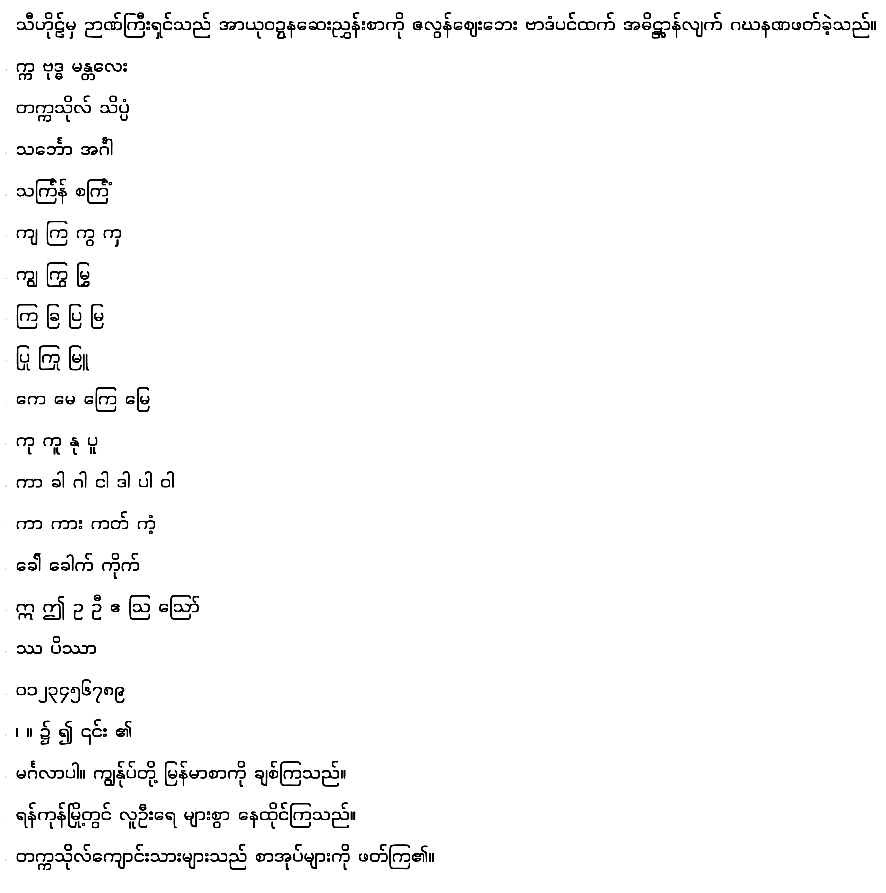

# Bagan Display

**Bold · squircle · Myanmar + Latin-1** · SIL Open Font License 1.1

A display face for headlines, posters, titles and app chrome — squared
enough to look built, round enough to stay friendly. Named for the brick
temples it borrows its geometry from: Bagan's architecture is exactly this
argument between the square and the circle.



## What makes it look like this

Two independent knobs, both new to the pipeline with this family, and both
recorded in the project file rather than baked into the outlines:

| Knob | Where | This font |
| :--- | :--- | :--- |
| **Skeleton shape** | `make_sample --squircle N` | `4` — every bowl warped from a circle onto a superellipse |
| **Nib shape** | `meta.pen` in the project JSON | `4` — the pen itself is a squircle, so terminals square off and diagonals thicken |
| Weight | `make_sample --weight X` | `1.80` — stroke widths against the extracted skeleton |
| Height | drawing scaled `y × 0.90` | keeps the fattened ink inside the design band |

The squircle warp is the one that does the visible work. Myanmar's
character lives in its bowls, and those are circles; a squared *nib* alone
only reaches the terminals, and the result still reads as a rounded sans.
Warping the skeleton — mapping each stroke's points from `(r, θ)` to
`(r · k(θ), θ)` about its own centre, then scaling back into its original
box — turns the circles themselves into squircles without changing a
letter's extents or where its anchors land.

The vertical compression is not decoration. Bolding by fattening the pen
pushes every mark upward, because mark anchors follow the base's ink: at
`×1.80` and full height, 930 clusters put ink above the design ascender.
At `y × 0.90` that is 10. Nothing was ever clipped — `usWinAscent` was
respected throughout — but a display face should sit inside its own band.

## Regenerating it

```bash
python3 pipeline/make_sample.py web/fonts/Padauk-Regular.ttf \
    projects/bagan-display/BaganDisplay.glyphstudio.json \
    --font-name "Bagan Display" --weight 1.8 --squircle 4
# then set meta.pen = 4, meta.styleName = "Bold", and scale the drawing y × 0.90
python3 pipeline/json_to_ufo.py projects/bagan-display/BaganDisplay.glyphstudio.json build/
fontmake -u build/*.ufo -o ttf --output-dir build/
python3 pipeline/postbuild.py build/*.ttf
```

## Status

| Check | Result |
| :--- | :--- |
| Shaping — spec corpus (1,486 clusters) | **0 FAIL**, 6 WARN |
| Shaping — word corpus (711 real words) | **0 FAIL**, 10 WARN |
| Shaping — full 12,450-word vocabulary | **0 FAIL**, 30 WARN |
| fontbakery universal | **0 FAIL** |
| CoreText vs HarfBuzz | 711 clusters, **0 differences** |
| Reading proof | 34 pages at [book.html](../../web/book.html) |

The WARNs are `bounds` (ink a little above the design ascender, never past
the clipping metrics) and `neighbour` (a mark touching the next syllable) —
both consequences of display weight, and both shared with the reference
font at its own bold end. 480 glyphs: the whole Myanmar block plus
Extended-A/B and Latin-1.

Not yet drawn, and it will show in running text: the fused **ဋ္ဌ** stack,
which no anchor placement can solve (see
[VALIDATION.md](../../docs/VALIDATION.md)). It needs traced artwork, and
this family inherits the gap from the pipeline rather than from anything
about its own design.

## Licence

SIL Open Font License 1.1 — see [OFL.txt](OFL.txt). Letterform skeletons
were extracted from **Padauk** © 2002–2025 SIL International, also under
the OFL; this is a Modified Version under that licence, renamed as the OFL
requires. Padauk's own Reserved Font Names are untouched.
